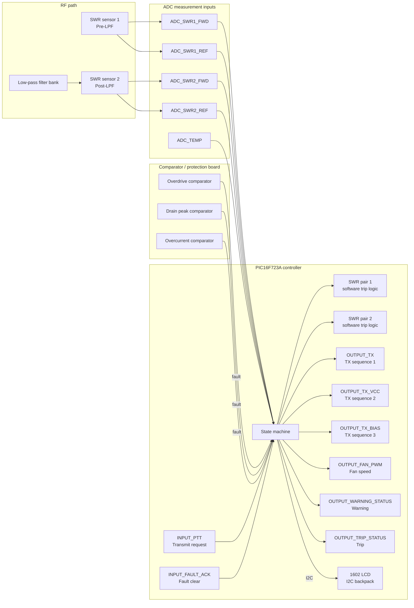

# Linear Amplifier Protection Controller

## Overview

This repository contains the current design for a PIC16F723A-based linear amplifier protection controller. The project is intentionally separated from the old RF/SWR prototype and is now focused on hardware fault protection, safe amplifier enable/disable behavior, operator feedback, and startup/latched fault handling.

## Current project status

The project is in a working design-and-firmware skeleton stage:

- the MCU pin map is documented and approved for the protection controller
- the state-machine concept is defined
- the firmware includes a protection-state skeleton and startup inhibit logic
- the build is configured through CMake for a PIC XC8 toolchain flow
- GitHub Actions workflows are in place for remote build/release automation

## Key documentation

- Architecture overview: [docs/project-architecture.md](docs/project-architecture.md)
- Hardware pin map: [docs/hardware/PIC16F723A_pin_map.md](docs/hardware/PIC16F723A_pin_map.md)
- Firmware entry point: [firmware/src/main.c](firmware/src/main.c)
- Pin definitions: [firmware/include/pin_map.h](firmware/include/pin_map.h)
- Project build presets: [CMakePresets.json](CMakePresets.json)
- GitHub Actions build workflow: [.github/workflows/firmware-build.yml](.github/workflows/firmware-build.yml)
- GitHub Actions release workflow: [.github/workflows/release-firmware.yml](.github/workflows/release-firmware.yml)
- Historical prototype/reference code: [prototype_reference](prototype_reference)

## Design direction

The controller is intended to use a layered protection model:

- hardware comparator trips for critical faults
- PIC firmware state machine for monitoring and safe sequencing
- I2C LCD status output using a standard backpack
- PTT-based re-arm behavior without bypassing live hardware faults
- startup inhibit and fault-latch behavior for safe operation

## Hardware overview

## Approved hardware pin map

This is the current approved signal map for the protection controller. The only I2C peripheral in the design is the 1602 LCD backpack.

| PIC pin | Port | Project name | Direction | Function |
|---|---|---|---|---|
| 11 | RC0 | INPUT_PTT | Input | Transmit request / key-down input |
| 12 | RC1 | INPUT_FAULT_ACK | Input | Fault clear / reset trigger |
| 13 | RC2 | spare | Input | Reserved if a separate hardware signal is needed later |
| 14 | RC3 | OUTPUT_LCD_I2C_SCL | Output | LCD backpack clock line |
| 15 | RC4 | OUTPUT_LCD_I2C_SDA | Output | LCD backpack data line |
| 16 | RC5 | OUTPUT_TX | Output | First TX sequencing driver |
| 17 | RC6 | OUTPUT_TX_VCC | Output | Second TX sequencing driver |
| 18 | RC7 | OUTPUT_TX_BIAS | Output | Final TX sequencing driver |
| 2 | RA0 | ADC_SWR1_FWD | Input | Pre-filter SWR forward power ADC |
| 3 | RA1 | ADC_SWR1_REF | Input | Pre-filter SWR reflected power ADC |
| 4 | RA2 | ADC_SWR2_FWD | Input | Post-filter SWR forward power ADC |
| 5 | RA3 | ADC_SWR2_REF | Input | Post-filter SWR reflected power ADC |
| 6 | RA4 | ADC_TEMP | Input | Temperature sensor input |
| 9,10 | OSC1, OSC2 | XTAL_IN/OUT | Input/Output | 20 MHz crystal |
| 1 | MCLR/VPP | RESET | Input | Master clear reset |
| 19 | RB0 | INPUT_SPARE_1 | Input | Free spare input; no SWR comparator required |
| 20 | RB1 | INPUT_SPARE_2 | Input | Free spare input; no SWR comparator required |
| 21 | RB2 | INPUT_COMP_OVERDRIVE | Input | Overdrive comparator |
| 22 | RB3 | INPUT_COMP_DRAIN_PEAK | Input | Drain peak comparator |
| 23 | RB4 | INPUT_COMP_OVERCURRENT | Input | Overcurrent comparator |
| 24 | RB5 | OUTPUT_FAN_PWM | Output | Fan speed control |
| 25 | RB6 | OUTPUT_WARNING_STATUS | Output | Warning status output |
| 26 | RB7 | OUTPUT_TRIP_STATUS | Output | Trip status output |
| 4,6,7,8,27,28 | VSS/VDD/NC | Power / support | Power | Follow datasheet decoupling rules |

## Current hardware assumptions

- MCU: PIC16F723A
- Clock: 20 MHz crystal
- Display: 1602 LCD with I2C backpack only
- Protection faults: software-driven SWR trip logic plus hardware comparator protection for overdrive, drain peak, and overcurrent detection
- SWR measurement pairs: two ADC pairs are required, one before and one after the low-pass filter bank, each with forward and reflected inputs
- Operator controls: INPUT_PTT and INPUT_FAULT_ACK
- Sequencing outputs: OUTPUT_TX, OUTPUT_TX_VCC, and OUTPUT_TX_BIAS
- Status outputs: OUTPUT_WARNING_STATUS and OUTPUT_TRIP_STATUS
- Output rule: all MCU output pins are active-low by default unless a specific hardware design requires otherwise
- Input rule: input pin names follow the actual hardware comparator/sensor polarity; no polarity suffix is added unless a signal deliberately breaks the default output rule

## SWR measurement logic

Each SWR channel is measured independently at its own RF point.

- Read the forward sample at that point.
- Read the reflected sample at that point.
- Compute the SWR for that local pair.
- Compare the result against the configured threshold.
- If the SWR exceeds the threshold, trip that channel.
- The default threshold is 2:1 unless a different limit is configured.

This applies to both SWR measurement points:

- pre-filter SWR sensor 1
- post-filter SWR sensor 2

The same logic is used for each pair and each sensor trips independently. A single high SWR at one measurement point must not be masked by a healthy reading at the other point.

## Naming convention used in code

All hardware symbols should follow the pattern:

- INPUT_... for external sense or control inputs
- OUTPUT_... for drive or status outputs
- Output pins are active-low by default
- Input pins use the actual hardware polarity and comparator behavior

Polarity suffixes are not added to pin names unless a specific signal intentionally breaks the default active-low output rule.

## Firmware state model

The protection controller uses a strict state machine with a hybrid protection model. SWR is computed in firmware from the forward and reflected ADC samples at each RF point. The comparator hardware remains the primary protection layer for fast analog faults such as overdrive, drain peak, and overcurrent. The PIC acts as the logic controller and sequencing manager.

### State definitions

The firmware should implement these states:

- STANDBY
  - system is idle
  - receive mode is active
  - TX outputs are disabled
  - comparators are monitored

- STARTUP_INHIBIT
  - active immediately after power-up
  - holds the comparator reset and TX outputs inactive for the startup interval
  - prevents false enable during the first power-on period

- WAIT_FOR_TX
  - PTT is high, so the amplifier is in receive mode
  - no transmit sequence is active
  - the controller continues to monitor temperature, current, and comparator faults

- TX_RESET
  - triggered when INPUT_PTT changes from high to low
  - a short active-low reset pulse is applied to the comparator latch/reset network
  - this is the same hardware action used for startup inhibit, just triggered on TX entry

- TX_SEQUENCE_1
  - OUTPUT_TX is asserted
  - this is the first transmit relay step and must happen immediately on a valid transmit request

- TX_SEQUENCE_2
  - OUTPUT_TX_VCC is asserted after the first step delay

- TX_SEQUENCE_3
  - OUTPUT_TX_BIAS is asserted after the second step delay

- TX_ACTIVE
  - all sequencing outputs are in their required state and the amplifier is allowed to run
  - normal operation continues while no safety fault is active

- WARNING
  - temperature or other monitored parameter is above warning threshold but below trip threshold
  - warning output is asserted and the display informs the operator

- THERMAL_LOCKOUT
  - configured temperature threshold (typically around 100 C) has been reached or exceeded
  - transmit is forbidden regardless of PTT
  - TX outputs remain disabled
  - this is a hard block, not a soft warning

- FAULT_LATCHED
  - a comparator fault or protection condition has latched
  - TX outputs are forced off
  - the system waits for conditions to return to a safe state and for the next valid re-arm cycle

- TRIP
  - a fault or temperature threshold has been exceeded during TX operation
  - the output sequence is aborted immediately
  - all transmitter outputs are disabled
  - the trip output is asserted
  - this state remains latched until the next safe restart condition

### Critical behavior rules

1. Hardware comparator faults take priority over software logic.
   - If an overdrive, drain peak, or overcurrent comparator indicates a live fault, TX must not start.

2. SWR faults are computed in firmware from the local forward/reflected ADC pair.
   - Each SWR sensor pair is evaluated independently.
   - A sensor trips when its calculated SWR exceeds the configured threshold, default 2:1.

2. PTT high means receive mode.
   - The transmitter is not active.

3. PTT low means transmit request.
   - the transmit sequence begins only after the reset action and safety checks complete.

4. If the configured temperature threshold is exceeded, transmit is blocked regardless of PTT.
   - This is a hard thermal lockout.

5. If the temperature threshold is exceeded during an active transmit sequence, the system immediately trips and disables TX.
   - This is a runtime thermal trip.

6. The reset action is shared between startup inhibit and TX entry.
   - In practice, startup and TX reset are the same hardware intent: clear latched comparator state and force safe idle before enable.

7. SWR protection does not require dedicated SWR comparators once the MCU has forward and reflected samples for each RF point.
   - The MCU computes the SWR and trips the channel in software.

### TX sequence ordering

For a valid transmit request, the controller should complete the sequence in this order:

1. INPUT_PTT goes low
2. apply the short comparator reset pulse
3. wait for the comparator reset settle time
4. check all comparator inputs and thermal limits
5. if safe, assert OUTPUT_TX
6. wait the first sequencing delay
7. assert OUTPUT_TX_VCC
8. wait the second sequencing delay
9. assert OUTPUT_TX_BIAS
10. enter TX_ACTIVE

All TX outputs are active-low driver lines and are forced inactive whenever a fault, trip, or thermal lockout condition is detected.

### Reset and re-arm behavior

A fresh transmit cycle is allowed only when:

- PTT is low
- no comparator trip is active
- temperature has not reached the trip or lockout threshold
- the output sequence is complete and the RF path is safe

When PTT returns high, the controller disables the TX sequence and returns to receive/idle operation. This is the reset point for the next cycle.

See [firmware/src/main.c](firmware/src/main.c) for the current firmware skeleton implementing these concepts.

## Build status

The local project build has been validated with the CMake/XC8 flow. The project is configured to build from the generated CMake preset structure and the workflow files are in place for GitHub-based automation.

## TODOs

The following items remain to be finalized before the design is considered complete:

1. Confirm the final meaning of INPUT_PTT and ensure the hardware uses a single transmit-request signal, with no duplicate key-down alias.
2. Finalize the FAULT_ACK behavior: trigger a short pulse on PTT entry or key-edge, and verify the pulse width is long enough to clear stale faults without causing false re-arm.
3. Confirm the TX sequencing order and timings: OUTPUT_TX first, then OUTPUT_TX_VCC, then OUTPUT_TX_BIAS. Add the exact delay values for each step.
4. Finalize the comparator board input assignments and threshold values for SWR, overdrive, overcurrent, and drain peak protection.
5. Confirm the exact overcurrent sensor transfer curve and comparator polarity; verify whether the comparator expects a rising or falling threshold crossing.
6. Define the warning and trip temperature thresholds and the corresponding fan-speed schedule.
7. Finalize the fan-drive scheme and whether it is analog, PWM, or stepped control.
8. Review all output pins and software assumptions against the final PCB layout before fabrication.
9. Validate the LCD backpack and I2C bus behavior with the final hardware map.
10. Add missing calibration constants and hardware-specific defaults after bench testing.
11. Confirm the GitHub Actions runner environment is valid for the appropriate XC8 toolchain and the release workflow attaches the correct build artifacts.
12. Update the hardware pin map and firmware macro names if any final PCB wiring changes are made.

## Reference / prototype note

The original prototype code remains in [prototype_reference](prototype_reference) as historical reference only. It should not be treated as the final protection-controller implementation.

## Repository purpose

This repository is for the current design, documentation, and firmware work for the amplifier protection system. It is not a general-purpose application project; it is a focused embedded safety controller for the amplifier chain.
