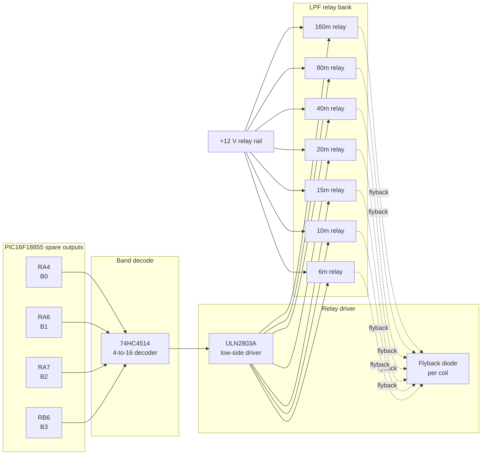

# LPF Band-Select Relay Netlist

## Purpose

The PIC16F18855 uses four spare GPIOs as a coarse 4-bit band-select bus. The selected band is decoded outside the MCU and used to energize the correct low-pass-filter relay. This keeps relay coil current off the MCU pins and provides a clean, stiff energy source for the relay pull-in.

## Recommended hardware parts

- PIC16F18855 spare bus:
  - RA4 = B0
  - RA6 = B1
  - RA7 = B2
  - RB6 = B3
- U1 = 74HC4514 or 74HC154-style decoder, active-high preferred
- U2 = ULN2803A or equivalent 8-channel low-side driver
- K1..K7 = 12 V relay coils, one per LPF band
- D1..D7 = flyback diodes, 1N4148 or 1N400x class part for each coil
- J1 = +12 V relay supply input
- GND = common logic and relay ground

## Band code table

| Band | B3 | B2 | B1 | B0 | Binary value |
|---|---:|---:|---:|---:|---:|
| Off / default | 0 | 0 | 0 | 0 | 0x0 |
| 160m | 0 | 0 | 0 | 1 | 0x1 |
| 80m | 0 | 0 | 1 | 0 | 0x2 |
| 40m | 0 | 0 | 1 | 1 | 0x3 |
| 20m | 0 | 1 | 0 | 0 | 0x4 |
| 15m | 0 | 1 | 0 | 1 | 0x5 |
| 10m | 0 | 1 | 1 | 0 | 0x6 |
| 6m | 0 | 1 | 1 | 1 | 0x7 |
| Reserved | 1 | x | x | x | 0x8-0xF |

## Netlist

### PIC side

- NET PIC_B0 = RA4
- NET PIC_B1 = RA6
- NET PIC_B2 = RA7
- NET PIC_B3 = RB6

### Decoder side

- U1.A0 = NET PIC_B0
- U1.A1 = NET PIC_B1
- U1.A2 = NET PIC_B2
- U1.A3 = NET PIC_B3
- U1.VCC = +5 V logic rail
- U1.GND = GND
- U1.EN = GND, unless a separate enable is required in the final design

### Active-high preferred decoder output mapping

- U1.Y1 = NET DEC_160M
- U1.Y2 = NET DEC_80M
- U1.Y3 = NET DEC_40M
- U1.Y4 = NET DEC_20M
- U1.Y5 = NET DEC_15M
- U1.Y6 = NET DEC_10M
- U1.Y7 = NET DEC_6M

If the selected decoder is a 74HC154, its outputs are active-low. In that case, add an inversion stage or use an active-high decoder such as 74HC4514 so the relay driver chain remains simple and unambiguous.

### Relay driver stage

- U2.IN1 = NET DEC_160M
- U2.IN2 = NET DEC_80M
- U2.IN3 = NET DEC_40M
- U2.IN4 = NET DEC_20M
- U2.IN5 = NET DEC_15M
- U2.IN6 = NET DEC_10M
- U2.IN7 = NET DEC_6M
- U2.GND = GND
- U2.COM = optional common clamp connection, see ULN2803 datasheet
- U2.VCC = not used for the low-side driver array; the coil supply is on the relay side

### Relay coils and flyback networks

- K1 coil: one side to NET LPF_12V, other side to U2.OUT1
- K2 coil: one side to NET LPF_12V, other side to U2.OUT2
- K3 coil: one side to NET LPF_12V, other side to U2.OUT3
- K4 coil: one side to NET LPF_12V, other side to U2.OUT4
- K5 coil: one side to NET LPF_12V, other side to U2.OUT5
- K6 coil: one side to NET LPF_12V, other side to U2.OUT6
- K7 coil: one side to NET LPF_12V, other side to U2.OUT7

- D1: cathode to NET LPF_12V, anode to U2.OUT1 coil node
- D2: cathode to NET LPF_12V, anode to U2.OUT2 coil node
- D3: cathode to NET LPF_12V, anode to U2.OUT3 coil node
- D4: cathode to NET LPF_12V, anode to U2.OUT4 coil node
- D5: cathode to NET LPF_12V, anode to U2.OUT5 coil node
- D6: cathode to NET LPF_12V, anode to U2.OUT6 coil node
- D7: cathode to NET LPF_12V, anode to U2.OUT7 coil node

- NET LPF_12V = J1.+12V relay supply
- NET GND = J1.GND, tied to the logic ground

### Relay contact net assignment

- K1.NO / COM / NC -> 160m LPF selection contact
- K2.NO / COM / NC -> 80m LPF selection contact
- K3.NO / COM / NC -> 40m LPF selection contact
- K4.NO / COM / NC -> 20m LPF selection contact
- K5.NO / COM / NC -> 15m LPF selection contact
- K6.NO / COM / NC -> 10m LPF selection contact
- K7.NO / COM / NC -> 6m LPF selection contact

The final contact arrangement depends on the filter-bank topology, but the control scheme remains: exactly one relay is energized at a time for the current band.

## Conceptual schematic block diagram

## Practical notes

- Keep the relay coil power supply separate from the MCU 5 V rail.
- Use common ground between logic and relay power grounds.
- Use one flyback diode per relay coil, not a single shared diode.
- Use the decoder output only as a logic signal; do not connect a relay coil directly to the decoder.
- If a 74HC154 is chosen instead of 74HC4514, add an inversion stage before the ULN2803 to prevent the relays from being active on the wrong state.

This arrangement is the simplest reliable implementation for the filter bank selector and leaves the PIC free to do the coarse frequency measurement and classification without having to source relay-coil current.
