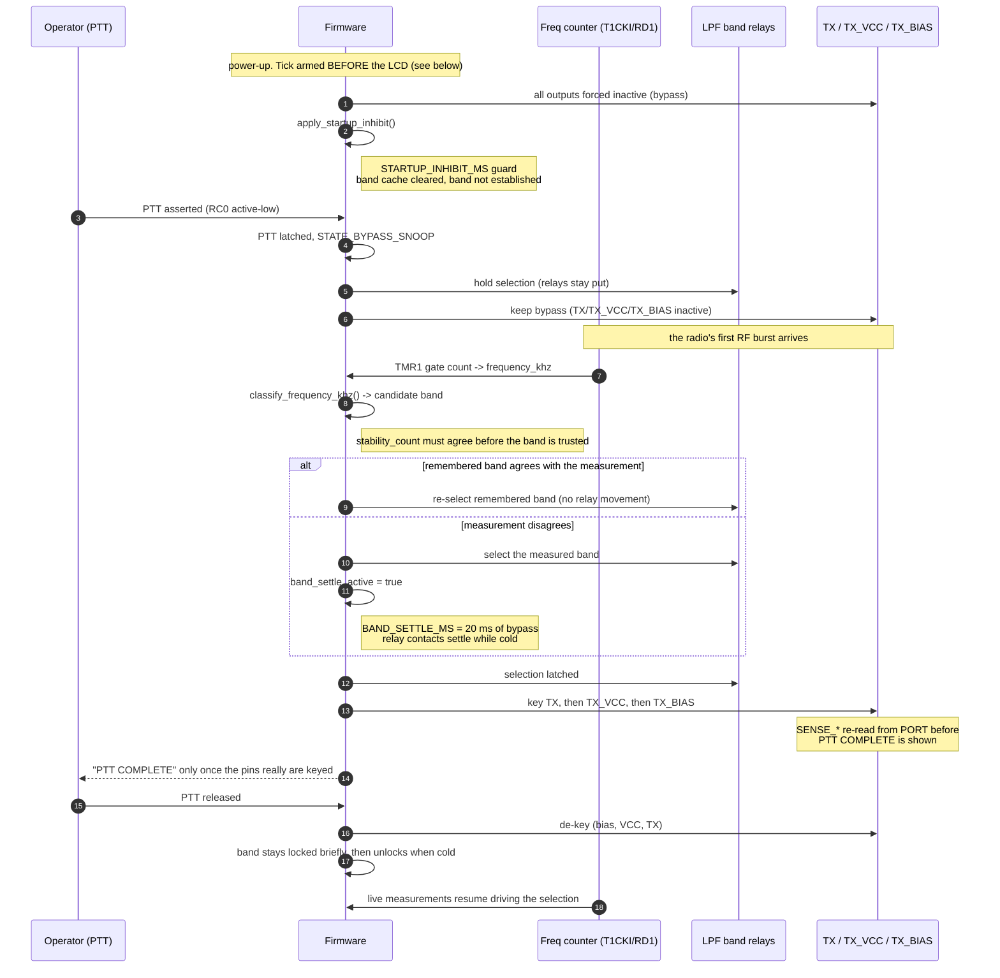
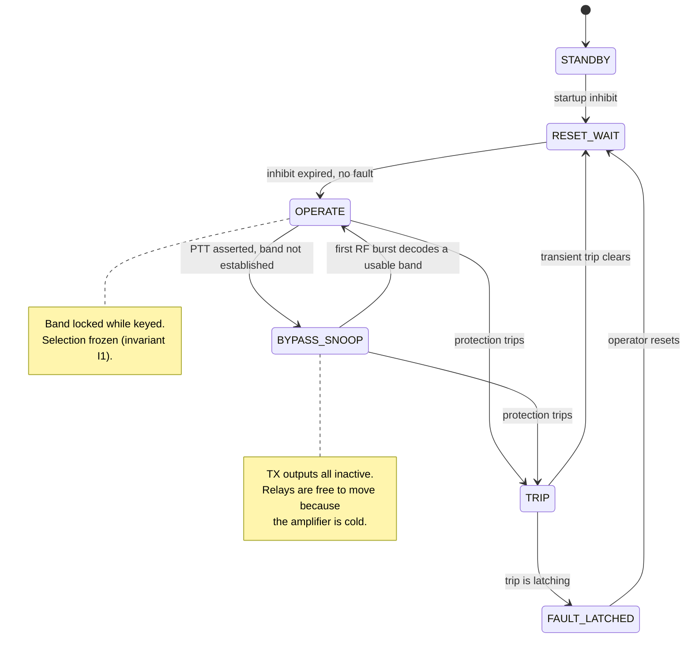

# Keying sequence and band selection

Date: 2026-09-22 · Branch: `upgrade/pic18f47q10` · Reflects `firmware/src/main.c` as built

This is the operator-visible behaviour of the controller: what happens between the PTT line being
pulled and RF reaching the antenna, and how the low-pass filter (LPF) band relays are chosen. It is
the map for the Q10 bring-up and for bench validation - every timing figure here is a `#define` in
`main.c` and is marked with whether it is measured or still a starting guess.

## The safety rule that shapes everything

**The LPF relays must never move while the amplifier is keyed.** A relay moving under bias can arc,
and the amplifier would be driving a filter that is mid-change. Every path below therefore has the
same shape: *go cold (bypass) → move the relays → wait for them to settle → key*. Anything that
wants to change the band while keyed must first drop to bypass.

## Keying sequence

## Band selection state machine

## The three band sources, in priority order

The firmware has three ways to know the band, and it must prefer the freshest because the operator
may have changed band between overs.

| Priority | Source | When it is used | Risk it carries |
|---|---|---|---|
| 1 | **Live frequency-counter measurement** | Whenever a usable RF burst decodes | None - it is what is actually being received |
| 2 | **Remembered band** (cache) | At keydown, before the radio transmits, so there is no RF yet | The operator may have moved bands since it was cached |
| 3 | **No band** | Nothing usable and nothing cached | Amplifier stays in bypass-snoop; never keys blind |

The remembered band is trusted at keydown **only** so that the first dit is not swallowed waiting for
a measurement. It is then *verified*: if the first usable measurement disagrees and the disagreement
persists for `BAND_VERIFY_MS`, the amplifier folds back to bypass, re-selects on the real band and
re-engages. That fold-back is clause (g) of the first-dit test.

## Timings - and which are guesses

| Constant | Value | Status |
|---|---|---|
| `BAND_SETTLE_MS` | 20 ms | **Starting guess.** Must be confirmed against the fitted relay's operate time on the bench. This is the window where the relays move with the amplifier cold. |
| `BAND_VERIFY_MS` | 20 ms | **Starting guess.** Must be short enough that a wrong-band engage is inaudible; confirm on the bench. |
| `BAND_CACHE_IDLE_TIMEOUT_MS` | 60 s | **Starting guess.** After this idle period the remembered band is discarded and the next PTT starts in snoop. Confirm the operator-visible behaviour is what is wanted. |
| Tick period | 1.000 ms | **Measured.** 16F: 32 MHz / Fosc/4 / 1:64 / (PR2+1=125). Q10: 64 MHz / Fosc/8 / 1:64 / 125. Every other timing above is counted in these ticks, so this one being right is what makes the rest meaningful. |

## Why the tick is armed before the LCD

`main()` used to configure the LCD **before** `timer0_init()`. The 1 ms tick is the only periodic
supervision the amplifier has - it is what expires the startup inhibit, the band-settle wait, the
band-verify timeout and every trip debounce - so an LCD that stalls (held E line, missing panel) left
the outputs latched with no supervision at all.

The order is now: force every output safe → arm the tick → apply the startup inhibit → *then* touch
the LCD. `tools/simulate/test_boot_safety_order.py` proves this and writes `boot_trace.png`: the tick
is up at ~1 ms from reset on both a normal boot and a stalled-LCD boot, with no output keyed at any
point.

## Register-level summary

| Signal | Pin | Direction | Notes |
|---|---|---|---|
| PTT | RC0 | input, active-low | weak pull-up on (`WPUC0`), digital (`ANSELC0 = 0`) |
| T1CKI (freq counter) | RD1 | input, via PPS | `T1CKIPPS = 0x19`; Timer1 async (`nSYNC = 1`), 1:4 prescale, 10 ms gate |
| Band relays 160m-10m | RD2-RD7 | outputs | one active-high pin per band, driven by `LATD` |
| TX / TX_VCC / TX_BIAS | RC5 / RC6 / RC7 | outputs, active-low | **read back through `PORT`**, not `LAT`, to confirm the pin really moved |
| Comparator reset | RC1 | output, active-low | external hardware comparator; `RB4` is its fault latch output |
| Hardware overcurrent fault | RB4 | input | read only; the on-chip comparator is never configured (see the skill's `W9602-COMP` note) |

## Test coverage of this behaviour

| Property | Proven by |
|---|---|
| No band change while keyed (I1) | `PTT_SequencerAndTripSuite`, `test_first_dit.py` |
| Keyed only with a locked band (I2) | same |
| Bypass-snoop keeps TX inactive (I3) | same |
| Selection agrees with `current_band` (I4) | same |
| Every selection change happens cold (I5) | same |
| T/R relay closes only after the band settles (I6) | same |
| Tick armed before the LCD can stall | `test_boot_safety_order.py` + `boot_trace.png` |
| Stimulus reaches the firmware on Q10 | `test_stimulus_positive_control.py` |
